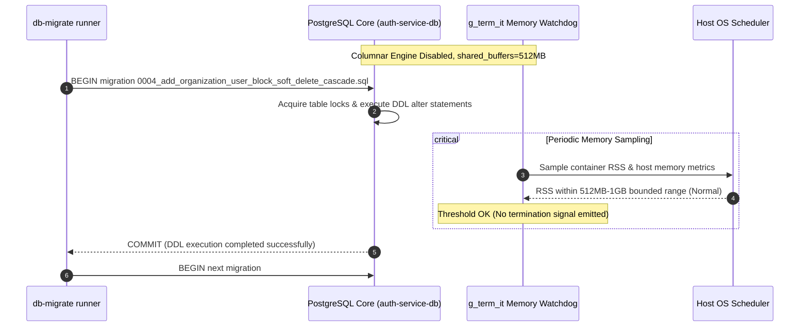

# ADR 0007: AlloyDB Omni Resource Constraints, Memory Optimization & OLTP Tuning

- **Status**: Accepted
- **Date**: 2026-09-06
- **Author**: @Chief-Strategist-J
- **Scope**: Database container resource management, AlloyDB Omni memory topology, Columnar Engine disabling, shared_buffers sizing, max_connections limiting, and preventing `g_term_it` proactive OOM backend termination in multi-database environments.

---

## 1. Context & Problem Statement

The `@observability/auth` service uses Google AlloyDB Omni (`google/alloydbomni:latest`) on port `31412` (`auth-service-db`) for ACID compliance, row-level security (RLS), multi-tenant mappings, and audit logging.

### The Problem
During automated startup and database migrations (`npm run auth`), client connections dropped unexpectedly with:
```text
auth-service-db             | 2026-09-06 10:54:34.365 UTC [232] WARNING: [g_term_it.cc:163] Memory critically low. Attempting termination of high memory footprint backend (pid=245 RSS=14MB) to avoid OOM.
observability-auth-service  | [db-migrate] PostgreSQL client error handled: Connection terminated unexpectedly
observability-auth-service  |   - [RETRY] 0004_add_organization_user_block_soft_delete_cascade.sql (attempt 1/3 failed: terminating connection due to administrator command).
```

### Root Cause Analysis
1. **Multi-Instance Resource Contention**:
   The host machine runs multiple heavy database and infrastructure containers concurrently (e.g., `llmobs-alloydb-db` hard-capped at 2GB running at ~90% memory utilization, Redis, Kafka, OTEL Collector, and Grafana Tempo).
2. **Default Columnar Engine Memory Allocation**:
   AlloyDB Omni enables Google's analytical columnar engine by default. In unrestricted container configurations, AlloyDB's internal memory manager attempts to reserve substantial host RAM (up to 80%) for columnar projection buffers and vector caches.
3. **Internal Proactive OOM Watchdog (`g_term_it.cc`)**:
   When the host approaches memory thresholds or active swap pressure, AlloyDB Omni's background supervisor thread (`g_term_it.cc`) actively executes an administrative termination of client backends with non-zero RSS footprint (even small ones, e.g. 14MB) to prevent kernel OOM kills.
4. **Workload Incompatibility**:
   The `@observability/auth` service is strictly an **OLTP (Online Transaction Processing)** service: indexed single-row lookups (`email`, `id`), transactional token revocation inserts, and audit logs. The analytical columnar engine was unnecessary and introduced memory volatility.

---

## 2. Decision & Architecture Overview

To guarantee deterministic database stability and allow coexistence with other local containers, the following architectural configurations are applied in `auth/docker-compose.yml`:

1. **Disable Google Columnar, ML Integration & Advisory Extensions**:
   - Environment: `ALLOYDB_ENABLE_COLUMNAR_ENGINE=false`
   - Postgres flags:
     - `-c google_columnar_engine.enabled=off`
     - `-c google_ml_integration.enabled=off`
     - `-c google_db_advisor.enabled=off`
     - `-c google_storage.replay_prefetcher_enabled=off`
   - *Impact*: Eliminates analytical vectorized buffer pools, AI/ML embedding memory reservations (saving 2GB+ RAM), and background workers that trigger proactive `g_term_it` backend terminations.

2. **Shared Buffers Right-Sizing**:
   - Postgres flag: `-c shared_buffers=256MB`
   - *Impact*: Replaces dynamic 80% RAM reservation with a fixed, predictable 256MB buffer cache ideal for auth OLTP caching.

3. **Connection Ceiling**:
   - Postgres flag: `-c max_connections=100`
   - *Impact*: Limits per-connection `work_mem` and stack overhead, preventing resource fragmentation under high concurrency.

4. **Container Memory & IPC Shared Memory Capping**:
   - Container limits: `deploy.resources.limits.memory: 4G`
   - Shared memory: `shm_size: '1gb'`
   - *Impact*: Bounds container memory growth so it cannot starve neighboring containers or trigger system-level swap thrashing, while providing adequate POSIX shared memory for Postgres parallel workers.

---

## 3. High-Level Design (HLD)

```mermaid
flowchart TD
    subgraph Host["Host Machine Memory Topology"]
        TotalRAM["Total Host Memory & Swap"]
        
        subgraph SiblingServices["Shared Infrastructure Containers"]
            LLMObsDB["llmobs-alloydb-db (Capped @ 2GB)"]
            Kafka["Kafka Broker (:31414)"]
            Redis["Redis Token Store (:31413)"]
        end

        subgraph AuthStack["@observability/auth Stack"]
            AuthApp["observability-auth-service (:3001)"]
            
            subgraph AuthDB["auth-service-db Container (:31412)"]
                direction TB
                Limits["Resource Limit: 4GB RAM | 1GB SHM"]
                EngineConfig["google_columnar_engine.enabled=off"]
                BufferConfig["shared_buffers=512MB"]
                ConnConfig["max_connections=100"]
                
                Limits --> BufferConfig
                BufferConfig --> EngineConfig
                EngineConfig --> ConnConfig
            end
        end

        TotalRAM -.-> SiblingServices
        TotalRAM -.-> AuthStack
        AuthApp -->|Connection Pool (max 20)| AuthDB
    end
```

---

## 4. Sequence Diagram: Migration Execution & OOM Prevention



---

## 5. Configuration Reference

```yaml
  auth-db:
    image: google/alloydbomni:latest
    container_name: auth-service-db
    shm_size: '1gb'
    deploy:
      resources:
        limits:
          memory: 4G
    ports:
      - "31412:5432"
    environment:
      - POSTGRES_USER=postgres
      - POSTGRES_PASSWORD=postgres
      - POSTGRES_DB=observability_auth
      - ALLOYDB_ENABLE_COLUMNAR_ENGINE=false
    command: >
      postgres
      -c shared_buffers=256MB
      -c google_columnar_engine.enabled=off
      -c google_ml_integration.enabled=off
      -c google_db_advisor.enabled=off
      -c google_storage.replay_prefetcher_enabled=off
      -c max_connections=100
    volumes:
      - auth_db_data:/var/lib/postgresql/data
    healthcheck:
      test: ["CMD-SHELL", "pg_isready -U postgres"]
      interval: 5s
      timeout: 5s
      retries: 5
    restart: unless-stopped
    networks:
      - auth-network
```

---

## 6. Consequences & Trade-offs

### Positive
- **Deterministic Migration Execution**: Eliminates unexpected `terminating connection due to administrator command` errors during migration runs.
- **Resource Stability**: Memory footprint of `auth-service-db` drops from unbounded/3.9GB+ to a predictable ~600MB-1GB working set.
- **Multi-Container Peace**: Can coexist alongside `llmobs-alloydb-db` and other data services without kernel or container OOM aborts.
- **Faster Startup**: Disabling columnar engine reduces database initialization time and eliminates catalog locking delays (`perfsnap worker`).

### Negative / Trade-offs
- **Analytical Acceleration Disabled**: Columnar indexing and vectorized aggregation queries will execute using standard Postgres row-oriented execution plans. For `@observability/auth`, this has zero negative impact as all queries are OLTP point lookups and primary-key joins.

---

## 7. Verification & Telemetry

1. **Verify Running Settings**:
   ```bash
   docker exec -it auth-service-db psql -U postgres -d observability_auth -c "SHOW shared_buffers; SHOW max_connections;"
   ```
   *Expected Output*: `512MB`, `100`.

2. **Verify Memory Consumption**:
   ```bash
   docker stats auth-service-db --no-stream
   ```
   *Expected Output*: Memory usage strictly bounded well below the 4GB cap.

3. **Verify Migrations**:
   ```bash
   npm run auth
   ```
   *Expected Output*: `[db-migrate] ✓ All database migrations applied` with zero connection drop retries.
