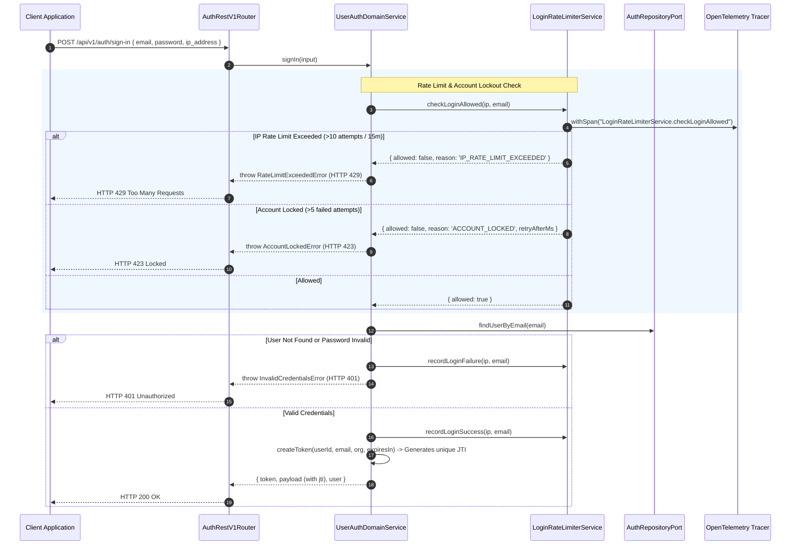
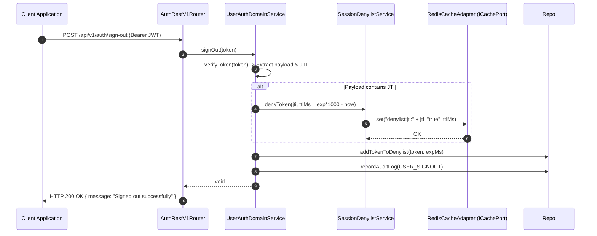
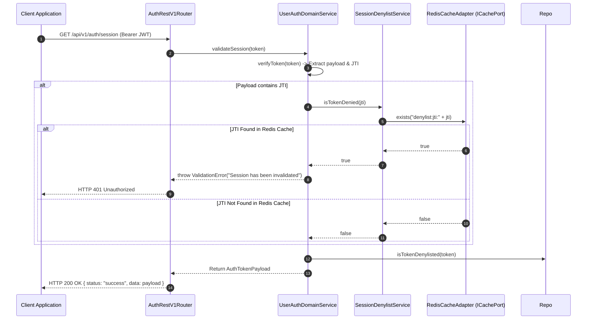

# ADR 0010: Redis JTI-Based Session Denylist and Adaptive Login Rate Limiting Architecture

- **Status**: Accepted
- **Date**: 2026-09-11
- **Context**: Stateless JWT authentication requires immediate token revocation capabilities upon sign-out or administrative action without sacrificing high throughput. Additionally, public authentication endpoints (`/api/v1/auth/sign-in`) require defense-in-depth against credential stuffing, password spraying, and brute-force attacks via IP sliding-window rate limiting and email account lockouts.

---

## 🏛 High-Level Design (HLD)

```mermaid
flowchart TD
    subgraph Client["Client Application"]
        UI["Web App / Consumer UI"]
        AuthClient["Auth API Client"]
    end

    subgraph Router["API Router Layer (:3001)"]
        RestRouter["AuthRestV1Router"]
    end

    subgraph ServiceLayer["Auth Domain Core"]
        UserAuth["UserAuthDomainService"]
        RateLimiter["LoginRateLimiterService"]
        DenylistService["SessionDenylistService"]
        Tracer["OpenTelemetry Tracer (withSpan)"]
    end

    subgraph DataInfra["Infrastructure Adapters & Cache"]
        RedisAdapter["RedisCacheAdapter (ICachePort)"]
        RedisStore[("Redis In-Memory Cache\nkey: denylist:jti:{jti}")]
        PostgresRepo[("Postgres / AlloyDB Auth Repository")]
    end

    UI -->|POST /sign-in| AuthClient
    UI -->|POST /sign-out| AuthClient
    UI -->|GET /session| AuthClient

    AuthClient -->|HTTP Request| RestRouter
    RestRouter -->|Invoke Domain Logic| UserAuth

    UserAuth -->|Check IP & Email Limits| RateLimiter
    UserAuth -->|Verify Hash & Password| PostgresRepo
    UserAuth -->|Check / Add Token JTI| DenylistService

    RateLimiter -->|Span Context| Tracer
    DenylistService -->|O(1) exists/set| RedisAdapter
    RedisAdapter -->|Read / Write| RedisStore
```

---

## 🔬 Low-Level Design (LLD)

### 1. Adaptive Sign-In & Rate-Limiting Flow



### 2. Sign-Out & Session Denylist Revocation Flow



### 3. Session Validation Flow



---

## 🌳 End-to-End Function Call Stack (ASCII Tree)

```tree
User Action (Sign-In / Sign-Out / Session Request)
└── UserAuthDomainService [src/features/auth/services/user-auth.service.ts]
    │
    ├── 1. Sign-In Pipeline (signIn)
    │   ├── SignInInputSchema.parse(input) [src/features/auth/schema/auth.schema.ts]
    │   ├── LoginRateLimiterService.checkLoginAllowed(ip, email) [src/features/auth/services/login-rate-limiter.service.ts]
    │   │   └── withSpan("LoginRateLimiterService.checkLoginAllowed") [src/infra/tracing/tracer.ts]
    │   │       ├── Check IP window array: rateLimitMap.get(ip) (Filter timestamps < 15m)
    │   │       └── Check email failure record: failedAttempts.get(email) (lockedUntilMs / CAPTCHA)
    │   │
    │   ├── AuthRepositoryPort.findUserByEmail(email)
    │   ├── verifyPassword(user.password_hash, password) [src/shared/utils/argon2.util.ts]
    │   │   ├── Failure: LoginRateLimiterService.recordLoginFailure(ip, email) -> throw InvalidCredentialsError
    │   │   └── Success: LoginRateLimiterService.recordLoginSuccess(ip, email) -> reset failedAttempts
    │   │
    │   └── createToken(userId, email, org, expiresIn) [src/shared/utils/jwt.util.ts]
    │       └── Generates unique JTI: "jti_" + randomBase36(13)
    │
    ├── 2. Sign-Out Pipeline (signOut)
    │   ├── verifyToken(token) [src/shared/utils/jwt.util.ts] -> Extract AuthTokenPayload.jti
    │   ├── SessionDenylistService.denyToken(jti, ttlMs) [src/features/auth/services/session-denylist.service.ts]
    │   │   └── withSpan("SessionDenylistService.denyToken") [src/infra/tracing/tracer.ts]
    │   │       └── RedisCacheAdapter.set("denylist:jti:" + jti, "true", ttlMs) [src/infra/adapters/redis/redis-cache.adapter.ts]
    │   │
    │   ├── AuthRepositoryPort.addTokenToDenylist(token, expMs)
    │   └── AuthRepositoryPort.recordAuditLog(USER_SIGNOUT)
    │
    └── 3. Session Validation Pipeline (validateSession)
        ├── verifyToken(token) [src/shared/utils/jwt.util.ts]
        ├── SessionDenylistService.isTokenDenied(jti) [src/features/auth/services/session-denylist.service.ts]
        │   └── withSpan("SessionDenylistService.isTokenDenied") [src/infra/tracing/tracer.ts]
        │       └── RedisCacheAdapter.exists("denylist:jti:" + jti) [src/infra/adapters/redis/redis-cache.adapter.ts]
        │           ├── true -> throw ValidationError("Session has been invalidated") [HTTP 401]
        │           └── false -> Continue session authorization
        └── AuthRepositoryPort.isTokenDenylisted(token)
```

---

## 📋 Architectural Principles & Security Hardening

1. **Deterministic `O(1)` Key Lookups**: Redis `exists` and `set` operations perform instant $O(1)$ checks on unique JTI keys (`denylist:jti:<jti>`), ensuring fast session verification.
2. **Automatic TTL Memory Reclamation**: Token denylist keys are stored with a TTL matching `(exp * 1000) - Date.now()`. Memory is automatically reclaimed by Redis when the JWT naturally expires.
3. **Adaptive Two-Tier Rate Limiting**:
   - **IP Window Rate Limit**: Sliding window tracking up to 10 attempts per 15-minute interval per IP address (`MAX_ATTEMPTS_PER_IP`).
   - **Email Lockout Threshold**: Maximum of 5 failed attempts per email address (`MAX_FAILED_PER_EMAIL`) triggers a 15-minute account lockout (`EMAIL_LOCKOUT_MS`).
4. **OpenTelemetry Full Visibility**: Every rate-limit check and session denylist lookup is wrapped in `withSpan()`, attaching client `ip`, target `email`, and `token.jti` to distributed traces for Grafana Tempo debugging.
5. **Decoupled Cache Interface (`ICachePort`)**: Services depend on the `ICachePort` interface, allowing pluggable execution between the lightweight `RedisCacheAdapter` (in-process) and distributed `ioredis` clusters.
