# ADR 0011: API Key Engine (TTL & Instant Revocation) and Transactional Mailer Adapter Architecture

- **Status**: Accepted
- **Date**: 2026-09-19
- **Deciders**: Observability Architecture Working Group, Platform Security Core
- **Context**: Enterprise observability backbones require strictly bounded ephemeral credentials for administrative operations (`ak_sec_` keys) with mandatory TTL enforcement and immediate edge revocation across multi-region edge nodes. Concurrently, multi-tenant authentication workflows (sign-up verification, team invitations, and password resets) require provider-agnostic, RFC 2045-compliant transactional email delivery with zero vendor lock-in, dynamic endpoint configuration, and fail-fast validation.

---

## 📑 Table of Contents

1. [High-Level Design (HLD)](#1-high-level-design-hld)
2. [Ports and Adapters (Hexagonal Architecture)](#2-ports-and-adapters-hexagonal-architecture)
3. [Low-Level Design (LLD) & Sequence Flows](#3-low-level-design-lld--sequence-flows)
   - [3.1 API Key Engine: TTL Enforcement, Instant Revocation & Telemetry](#31-api-key-engine-ttl-enforcement-instant-revocation--telemetry)
   - [3.2 Transactional Mailer: Fail-Fast Execution Pipeline](#32-transactional-mailer-fail-fast-execution-pipeline)
   - [3.3 Email Verification: Sign-Up to Atomic Confirmation](#33-email-verification-sign-up-to-atomic-confirmation)
   - [3.4 SMTP Wire Protocol Exchange (RFC 5321 & RFC 3207)](#34-smtp-wire-protocol-exchange-rfc-5321--rfc-3207)
4. [Finite State Machines & Lifecycle Transitions](#4-finite-state-machines--lifecycle-transitions)
   - [4.1 API Key Lifecycle State Machine](#41-api-key-lifecycle-state-machine)
   - [4.2 Email Verification Token Lifecycle State Machine](#42-email-verification-token-lifecycle-state-machine)
5. [Open Standards & Protocol Specifications](#5-open-standards--protocol-specifications)
   - [5.1 MIME RFC 2045 & RFC 5322 Multipart Architecture](#51-mime-rfc-2045--rfc-5322-multipart-architecture)
   - [5.2 AWS Signature Version 4 (SigV4) Cryptographic Pipeline](#52-aws-signature-version-4-sigv4-cryptographic-pipeline)
   - [5.3 ScalableHttpClient 8-Step Resilience Pipeline](#53-scalablehttpclient-8-step-resilience-pipeline)
6. [Relational Database Schema & Migrations](#6-relational-database-schema--migrations)
7. [Distributed Observability & TraceQL Queries](#7-distributed-observability--traceql-queries)
8. [Comprehensive API Curl Reference & Protocol Payloads](#8-comprehensive-api-curl-reference--protocol-payloads)
   - [8.1 Create Ephemeral super_secret API Key (Mandatory TTL)](#81-create-ephemeral-super_secret-api-key-mandatory-ttl)
   - [8.2 Reject super_secret Key Missing TTL](#82-reject-super_secret-key-missing-ttl)
   - [8.3 Reject super_secret Key Exceeding 90-Day Max TTL](#83-reject-super_secret-key-exceeding-90-day-max-ttl)
   - [8.4 Verify API Key & Record Usage Telemetry](#84-verify-api-key--record-usage-telemetry)
   - [8.5 Revoke API Key (Dual-Layer: DB + Redis)](#85-revoke-api-key-dual-layer-db--redis)
   - [8.6 Verify Revoked API Key (Assert Immediate Rejection)](#86-verify-revoked-api-key-assert-immediate-rejection)
   - [8.7 Verify Expired API Key (Assert Expiration Rejection)](#87-verify-expired-api-key-assert-expiration-rejection)
   - [8.8 User Sign-Up (Triggers Async Verification Dispatch)](#88-user-sign-up-triggers-async-verification-dispatch)
   - [8.9 Resend Email Verification Token](#89-resend-email-verification-token)
   - [8.10 Confirm Email Verification (Atomic Consumption)](#810-confirm-email-verification-atomic-consumption)
   - [8.11 Reject Invalid / Consumed Email Verification Token](#811-reject-invalid--consumed-email-verification-token)
9. [Configuration Decoupling Matrix](#9-configuration-decoupling-matrix)
10. [Security & Compliance Architecture](#10-security--compliance-architecture)
11. [Verification & Proof of Correctness](#11-verification--proof-of-correctness)

---

## 🏛 1. High-Level Design (HLD)

The authentication subsystem sits at the boundary of incoming traffic, managing identity issuance, token lifecycle, and administrative credentials. The system decouples business workflows from transport gateways and data stores via strict Hexagonal architecture.

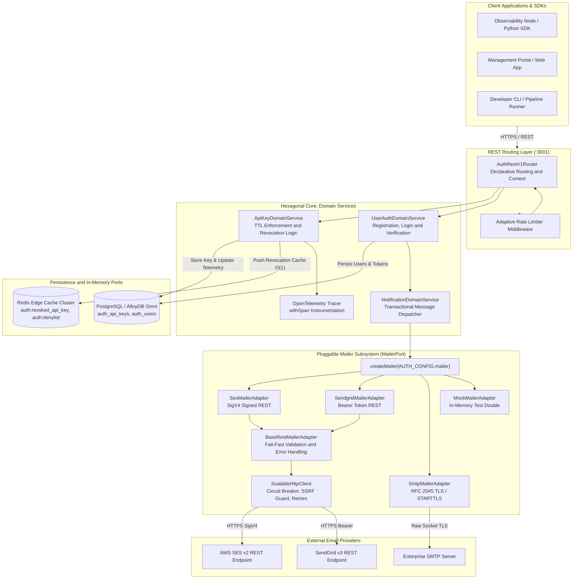

---

## 🧩 2. Ports and Adapters (Hexagonal Architecture)

The system enforces strict boundary isolation. Domain services only communicate with typed interfaces (Ports). External integrations implement these ports as Adapters, allowing zero-code-change provider replacement.

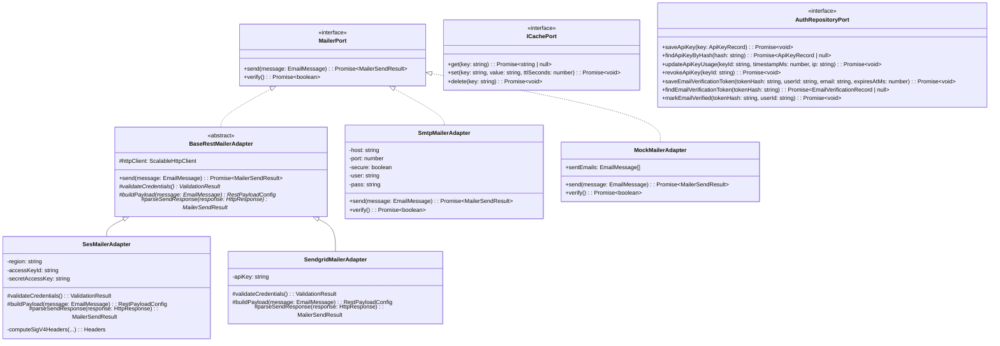

---

## 🔬 3. Low-Level Design (LLD) & Sequence Flows

### 3.1 API Key Engine: TTL Enforcement, Instant Revocation & Telemetry

The API key subsystem guarantees that high-privilege keys (`super_secret`) cannot be created without an explicit, bounded expiration timestamp. When verified, requests pass through edge cache denylists before updating database usage telemetry.

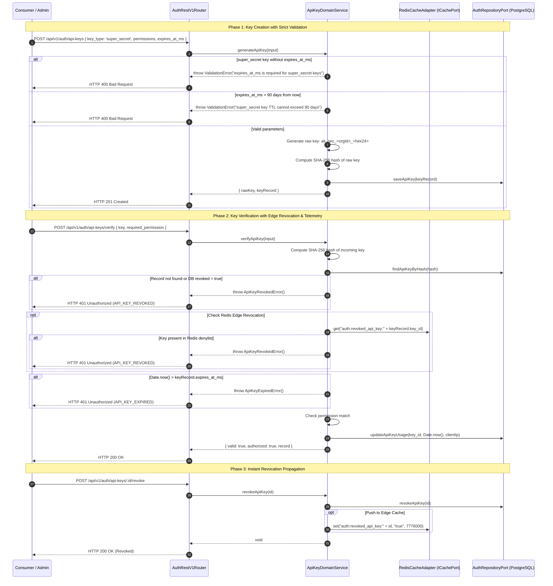

---

### 3.2 Transactional Mailer: Fail-Fast Execution Pipeline

The `BaseRestMailerAdapter` enforces a strict 4-phase template method execution pipeline to protect system resources and reject invalid messages before performing network operations or socket allocation.

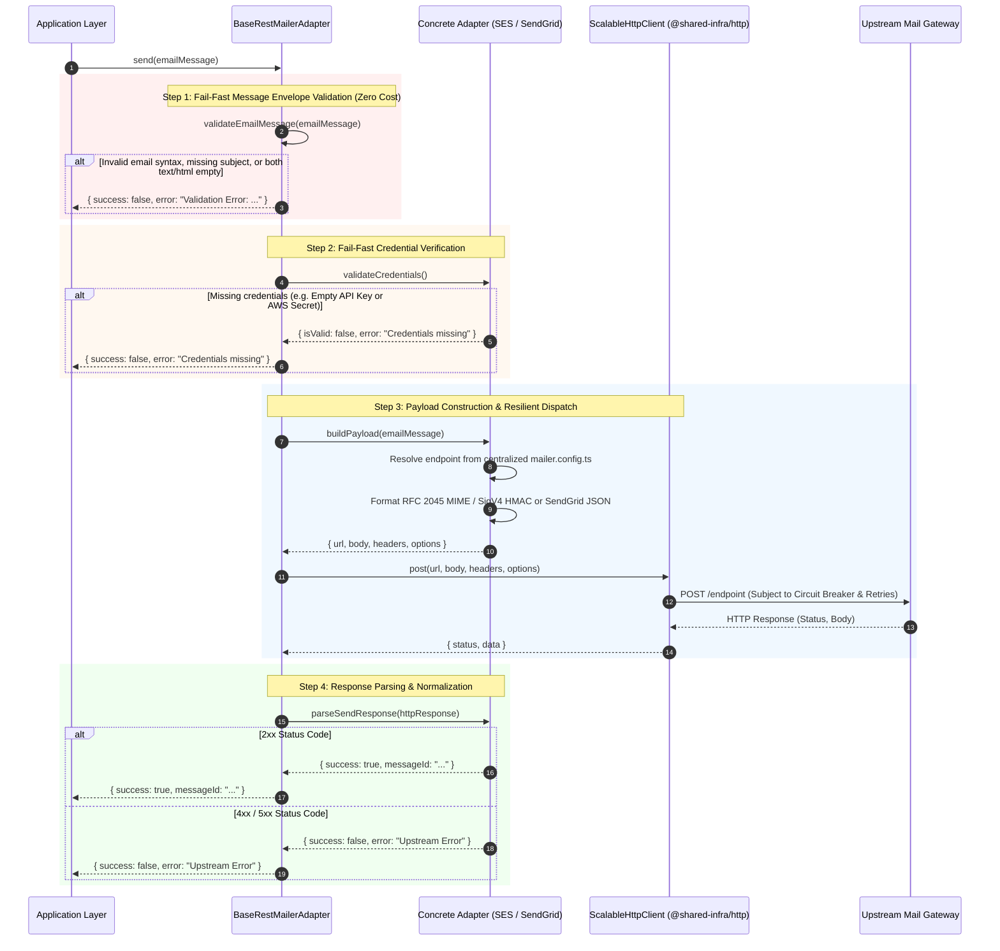

---

### 3.3 Email Verification: Sign-Up to Atomic Confirmation

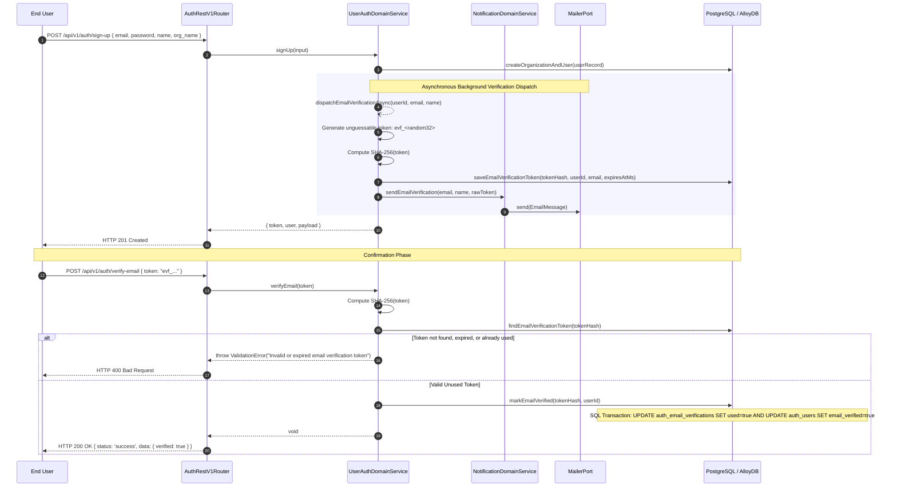

---

### 3.4 SMTP Wire Protocol Exchange (RFC 5321 & RFC 3207)

When `SmtpMailerAdapter` is engaged, it connects via TCP socket, negotiates transport layer security via STARTTLS, executes authentication, and streams standard MIME data:

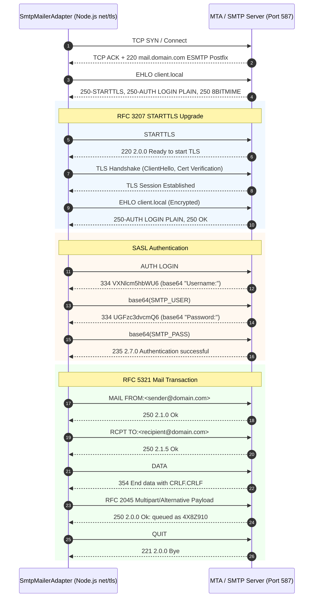

---

## 🔄 4. Finite State Machines & Lifecycle Transitions

### 4.1 API Key Lifecycle State Machine

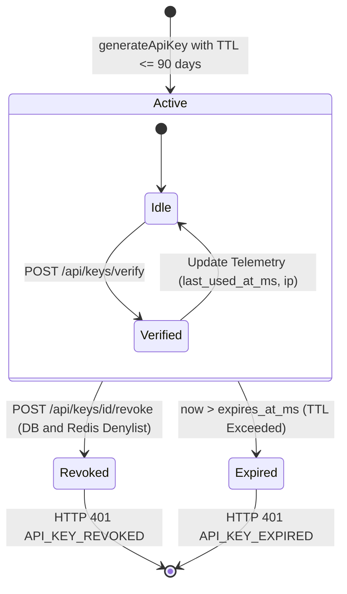

---

### 4.2 Email Verification Token Lifecycle State Machine

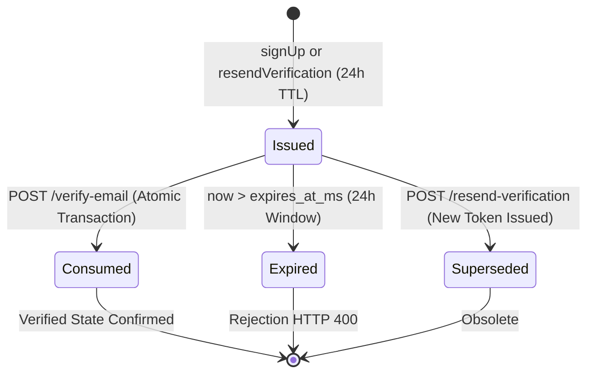

---

## 📜 5. Open Standards & Protocol Specifications

### 5.1 MIME RFC 2045 & RFC 5322 Multipart Architecture

All transactional emails generated by `@observability/auth` assemble RFC 2045 / RFC 5322 compliant `multipart/alternative` message streams:

```
From: Observability Platform <no-reply@observability.internal>
To: recipient@company.com
Subject: Verify Your Account
Date: Sat, 19 Sep 2026 10:15:00 GMT
Message-ID: <3d5a2f8c-9b1e-4c7a-8b2d-1a2b3c4d5e6f@observability.internal>
MIME-Version: 1.0
Content-Type: multipart/alternative; boundary="----=_Part_9f8e7d6c5b4a3a2b1"

------=_Part_9f8e7d6c5b4a3a2b1
Content-Type: text/plain; charset=UTF-8
Content-Transfer-Encoding: quoted-printable

Please verify your account by following this link:
https://app.observability.internal/verify?token=3Devf_bplwxrme3go

------=_Part_9f8e7d6c5b4a3a2b1
Content-Type: text/html; charset=UTF-8
Content-Transfer-Encoding: quoted-printable

<!DOCTYPE html>
<html>
<body>
  <h2>Welcome to Observability Platform</h2>
  <p>Please click below to verify your account:</p>
  <a href=3D"https://app.observability.internal/verify?token=3Devf_bplwxrme3go">Verify Email</a>
</body>
</html>

------=_Part_9f8e7d6c5b4a3a2b1--
```

---

### 5.2 AWS Signature Version 4 (SigV4) Cryptographic Pipeline

The `SesMailerAdapter` signs requests natively with zero AWS SDK dependencies using HMAC-SHA256 (RFC 2104):

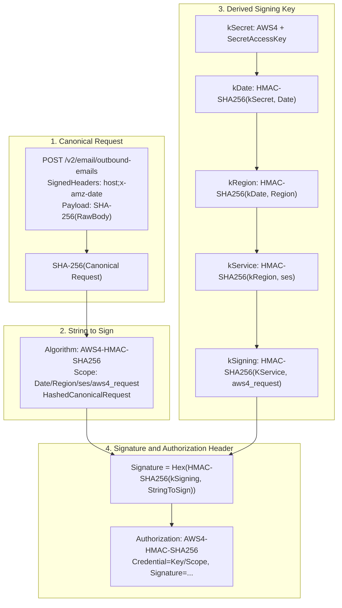

---

### 5.3 ScalableHttpClient 8-Step Resilience Pipeline

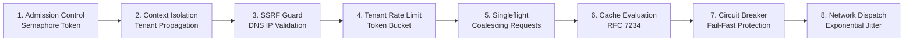

---

## 🗄 6. Relational Database Schema & Migrations

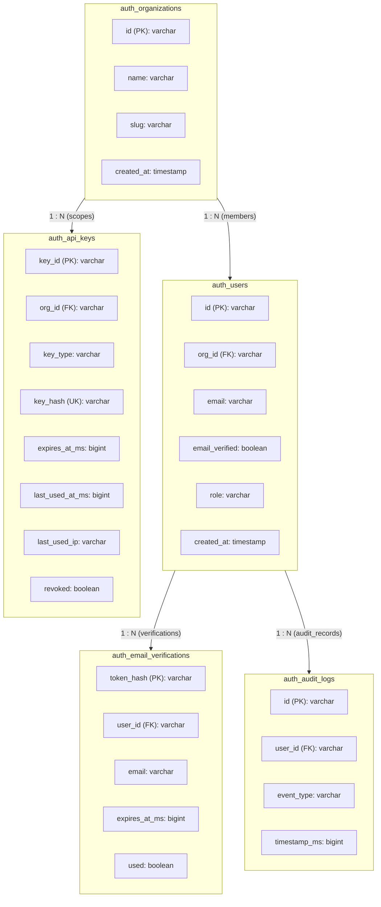

### Migration 0007: API Key Expiration & Usage Telemetry

```sql
-- Migration: 0007_add_api_key_expiration_and_usage.sql
ALTER TABLE auth_api_keys 
ADD COLUMN IF NOT EXISTS expires_at_ms BIGINT,
ADD COLUMN IF NOT EXISTS last_used_at_ms BIGINT,
ADD COLUMN IF NOT EXISTS last_used_ip VARCHAR(64);

CREATE INDEX IF NOT EXISTS idx_auth_api_keys_expires_at ON auth_api_keys(expires_at_ms);
CREATE INDEX IF NOT EXISTS idx_auth_api_keys_revoked ON auth_api_keys(revoked);
```

### Migration 0008: Email Verification Tokens Table

```sql
-- Migration: 0008_create_email_verifications_table.sql
CREATE TABLE IF NOT EXISTS auth_email_verifications (
    token_hash VARCHAR(64) PRIMARY KEY,
    user_id VARCHAR(64) NOT NULL REFERENCES auth_users(id) ON DELETE CASCADE,
    email VARCHAR(255) NOT NULL,
    expires_at_ms BIGINT NOT NULL,
    used BOOLEAN NOT NULL DEFAULT FALSE,
    created_at TIMESTAMP WITH TIME ZONE NOT NULL DEFAULT NOW(),
    deleted_at TIMESTAMP WITH TIME ZONE
);

CREATE INDEX IF NOT EXISTS idx_auth_email_verifications_user_id ON auth_email_verifications(user_id);
CREATE INDEX IF NOT EXISTS idx_auth_email_verifications_email ON auth_email_verifications(email);
CREATE INDEX IF NOT EXISTS idx_auth_email_verifications_expires_at ON auth_email_verifications(expires_at_ms);

ALTER TABLE auth_users ADD COLUMN IF NOT EXISTS email_verified BOOLEAN NOT NULL DEFAULT FALSE;
```

---

## 📡 7. Distributed Observability & TraceQL Queries

Every operation is instrumented using OpenTelemetry spans. The span hierarchy links incoming HTTP requests directly to domain logic, cache queries, and outbound HTTP/SMTP dispatches:

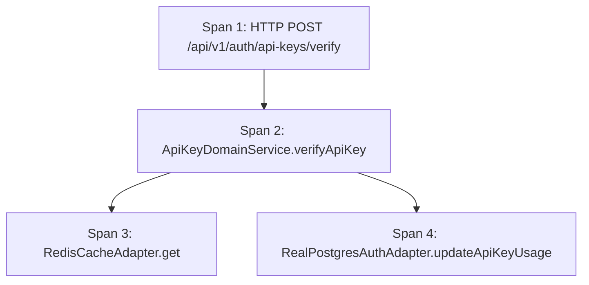

### TraceQL Debugging Queries for Grafana Tempo

```traceql
# 1. Find all rejected API key verification attempts due to expiration
{ span.name = "ApiKeyDomainService.verifyApiKey" && status = error && api_key.status = "expired" }

# 2. Track revoked API keys blocked by Redis edge cache
{ span.name = "ApiKeyDomainService.verifyApiKey" && api_key.revocation_source = "redis_cache" }

# 3. Detect outbound mailer failures and network retries
{ span.name = "SesMailerAdapter.send" && status = error }

# 4. Monitor email verification latency end-to-end
{ span.name = "UserAuthDomainService.verifyEmail" }
```

---

## 💻 8. Comprehensive API Curl Reference & Protocol Payloads

### 8.1 Create Ephemeral super_secret API Key (Mandatory TTL)

```bash
# Set expiration 30 days from now (epoch ms)
EXPIRES_AT_MS=$(( $(date +%s%3N) + 30 * 86400000 ))

curl -s -X POST "http://localhost:3001/api/v1/auth/api-keys" \
  -H "Content-Type: application/json" \
  -H "Authorization: Bearer <VALID_ADMIN_JWT_TOKEN>" \
  -H "x-request-id: req-sec-create-001" \
  -H "x-tenant-id: org_alpha_01" \
  -d '{
    "org_id": "org_alpha_01",
    "name": "Production Ingestion Pipeline Key",
    "key_type": "super_secret",
    "permissions": ["admin:all", "traces:write", "metrics:write"],
    "expires_at_ms": '"${EXPIRES_AT_MS}"'
  }'
```

#### Response Envelope: `201 Created`
```json
{
  "status": "success",
  "message": "API key successfully created",
  "data": {
    "rawKey": "ak_sec_org_alpha_01_a9f8b7c6d5e4f3a2b1c0d9e8",
    "keyRecord": {
      "key_id": "key_7a8b9c0d",
      "org_id": "org_alpha_01",
      "key_type": "super_secret",
      "key_hash": "b2c3d4e5f6a1b2c3d4e5f6a1b2c3d4e5f6a1b2c3d4e5f6a1b2c3d4e5f6a1b2c3",
      "prefix": "ak_sec_",
      "name": "Production Ingestion Pipeline Key",
      "permissions": ["admin:all", "traces:write", "metrics:write"],
      "created_at_ms": 1789812000000,
      "revoked": false,
      "expires_at_ms": 1792404000000,
      "last_used_at_ms": null,
      "last_used_ip": null
    }
  },
  "error": null
}
```

---

### 8.2 Reject super_secret Key Missing TTL

```bash
curl -s -X POST "http://localhost:3001/api/v1/auth/api-keys" \
  -H "Content-Type: application/json" \
  -H "Authorization: Bearer <VALID_ADMIN_JWT_TOKEN>" \
  -d '{
    "org_id": "org_alpha_01",
    "name": "Invalid Ephemeral Key",
    "key_type": "super_secret",
    "permissions": ["admin:all"]
  }'
```

#### Response Envelope: `400 Bad Request`
```json
{
  "status": "error",
  "message": "expires_at_ms is required for super_secret keys",
  "data": null,
  "error": {
    "code": "VALIDATION_ERROR",
    "details": "expires_at_ms is required for super_secret keys"
  }
}
```

---

### 8.3 Reject super_secret Key Exceeding 90-Day Max TTL

```bash
# 91 days into future
EXPIRES_TOO_FAR=$(( $(date +%s%3N) + 91 * 86400000 ))

curl -s -X POST "http://localhost:3001/api/v1/auth/api-keys" \
  -H "Content-Type: application/json" \
  -H "Authorization: Bearer <VALID_ADMIN_JWT_TOKEN>" \
  -d '{
    "org_id": "org_alpha_01",
    "name": "Excessive TTL Key",
    "key_type": "super_secret",
    "permissions": ["admin:all"],
    "expires_at_ms": '"${EXPIRES_TOO_FAR}"'
  }'
```

#### Response Envelope: `400 Bad Request`
```json
{
  "status": "error",
  "message": "super_secret key TTL cannot exceed 90 days",
  "data": null,
  "error": {
    "code": "VALIDATION_ERROR",
    "details": "super_secret key TTL cannot exceed 90 days"
  }
}
```

---

### 8.4 Verify API Key & Record Usage Telemetry

```bash
curl -s -X POST "http://localhost:3001/api/v1/auth/api-keys/verify" \
  -H "Content-Type: application/json" \
  -H "X-Forwarded-For: 198.51.100.77" \
  -d '{
    "key": "ak_sec_org_alpha_01_a9f8b7c6d5e4f3a2b1c0d9e8",
    "required_permission": "traces:write"
  }'
```

#### Response Envelope: `200 OK`
```json
{
  "status": "success",
  "message": "API key verified",
  "data": {
    "valid": true,
    "authorized": true,
    "record": {
      "key_id": "key_7a8b9c0d",
      "org_id": "org_alpha_01",
      "key_type": "super_secret",
      "name": "Production Ingestion Pipeline Key",
      "permissions": ["admin:all", "traces:write", "metrics:write"],
      "expires_at_ms": 1792404000000,
      "last_used_at_ms": 1789812050000,
      "last_used_ip": "198.51.100.77"
    }
  },
  "error": null
}
```

---

### 8.5 Revoke API Key (Dual-Layer: DB + Redis)

```bash
curl -s -X POST "http://localhost:3001/api/v1/auth/api-keys/key_7a8b9c0d/revoke" \
  -H "Authorization: Bearer <VALID_ADMIN_JWT_TOKEN>"
```

#### Response Envelope: `200 OK`
```json
{
  "status": "success",
  "message": "API key revoked",
  "data": null,
  "error": null
}
```

---

### 8.6 Verify Revoked API Key (Assert Immediate Rejection)

```bash
curl -s -X POST "http://localhost:3001/api/v1/auth/api-keys/verify" \
  -H "Content-Type: application/json" \
  -d '{
    "key": "ak_sec_org_alpha_01_a9f8b7c6d5e4f3a2b1c0d9e8",
    "required_permission": "traces:write"
  }'
```

#### Response Envelope: `401 Unauthorized`
```json
{
  "status": "error",
  "message": "API key has been revoked or invalid",
  "data": null,
  "error": {
    "code": "API_KEY_REVOKED",
    "details": "API key has been revoked or invalid"
  }
}
```

---

### 8.7 Verify Expired API Key (Assert Expiration Rejection)

```bash
curl -s -X POST "http://localhost:3001/api/v1/auth/api-keys/verify" \
  -H "Content-Type: application/json" \
  -d '{
    "key": "ak_sec_org_expired_example_key",
    "required_permission": "traces:write"
  }'
```

#### Response Envelope: `401 Unauthorized`
```json
{
  "status": "error",
  "message": "API key has expired",
  "data": null,
  "error": {
    "code": "API_KEY_EXPIRED",
    "details": "API key has expired"
  }
}
```

---

### 8.8 User Sign-Up (Triggers Async Verification Dispatch)

```bash
curl -s -X POST "http://localhost:3001/api/v1/auth/sign-up" \
  -H "Content-Type: application/json" \
  -d '{
    "email": "lead.architect@company.com",
    "password": "SuperSecretPassword123!",
    "name": "Lead Architect",
    "org_name": "Enterprise Observability Org"
  }'
```

#### Response Envelope: `201 Created`
```json
{
  "status": "success",
  "message": "User registered successfully",
  "data": {
    "token": "eyJhbGciOiJIUzI1NiIsInR5cCI6IkpXVCJ9...",
    "user": {
      "id": "usr_99887766",
      "org_id": "org_55443322",
      "email": "lead.architect@company.com",
      "name": "Lead Architect",
      "role": "owner",
      "blocked": false,
      "email_verified": false,
      "user_permissions": ["*"]
    }
  },
  "error": null
}
```

---

### 8.9 Resend Email Verification Token

```bash
curl -s -X POST "http://localhost:3001/api/v1/auth/resend-verification" \
  -H "Content-Type: application/json" \
  -d '{
    "email": "lead.architect@company.com"
  }'
```

#### Response Envelope: `200 OK`
```json
{
  "status": "success",
  "message": "Verification email resent",
  "data": {
    "sent": true
  },
  "error": null
}
```

---

### 8.10 Confirm Email Verification (Atomic Consumption)

```bash
curl -s -X POST "http://localhost:3001/api/v1/auth/verify-email" \
  -H "Content-Type: application/json" \
  -d '{
    "token": "evf_bplwxrme3go771122"
  }'
```

#### Response Envelope: `200 OK`
```json
{
  "status": "success",
  "message": "Email verified successfully",
  "data": {
    "verified": true
  },
  "error": null
}
```

---

### 8.11 Reject Invalid / Consumed Email Verification Token

```bash
curl -s -X POST "http://localhost:3001/api/v1/auth/verify-email" \
  -H "Content-Type: application/json" \
  -d '{
    "token": "evf_already_consumed_token"
  }'
```

#### Response Envelope: `400 Bad Request`
```json
{
  "status": "error",
  "message": "Invalid or expired email verification token",
  "data": null,
  "error": {
    "code": "VALIDATION_ERROR",
    "details": "Invalid or expired email verification token"
  }
}
```

---

## ⚙️ 9. Configuration Decoupling Matrix

All endpoints, paths, and provider parameters are externalized in `src/config/mailer.config.ts` and loaded through environment configuration:

| Configuration Path | Environment Variable | Default Setting | Description & Upstream Contract |
|---|---|---|---|
| `mailer.provider` | `MAILER_PROVIDER` | `mock` (or `ses`, `sendgrid`, `smtp`) | Active mailer provider selection |
| `mailer.from` | `MAILER_FROM` | `no-reply@observability.internal` | Standard envelope sender identity |
| `mailer.ses.region` | `AWS_REGION` | `us-east-1` | AWS SES target deployment region |
| `mailer.ses.endpointTemplate` | `AWS_SES_ENDPOINT_TEMPLATE` | `https://email.{region}.amazonaws.com` | Dynamically interpolated SES endpoint |
| `mailer.ses.sendPath` | `AWS_SES_SEND_PATH` | `/v2/email/outbound-emails` | SES v2 Raw MIME dispatch path |
| `mailer.ses.accountPath` | `AWS_SES_ACCOUNT_PATH` | `/v2/email/account` | SES connectivity & quota verification path |
| `mailer.sendgrid.apiUrl` | `SENDGRID_API_URL` | `https://api.sendgrid.com` | Base URL for SendGrid REST gateway |
| `mailer.sendgrid.sendPath` | `SENDGRID_SEND_PATH` | `/v3/mail/send` | SendGrid v3 transactional dispatch path |
| `mailer.sendgrid.verifyPath` | `SENDGRID_VERIFY_PATH` | `/v3/user/profile` | SendGrid API key verification path |
| `mailer.smtp.host` | `SMTP_HOST` | `localhost` | Corporate / relay SMTP host |
| `mailer.smtp.port` | `SMTP_PORT` | `587` | Standard submission port (STARTTLS) |
| `mailer.smtp.secure` | `SMTP_SECURE` | `false` | `true` for Port 465 SSL, `false` for 587 STARTTLS |

---

## 🛡 10. Security & Compliance Architecture

1. **Strict Cryptographic Hashing at Rest**:
   - Neither API key secrets nor email verification tokens are stored in plaintext. Raw values exist in memory solely during creation and dispatch.
   - Database tables store SHA-256 hashes (`key_hash` and `token_hash`).
   - Passwords use Argon2id with recommended memory and parallelism parameters.

2. **Defense-in-Depth Instant Revocation**:
   - Database persistence provides auditable and durable record of revocation.
   - Redis edge cache stores revoked key IDs (`auth:revoked_api_key:{id}`) with 90-day TTL matching maximum key lifespan, enabling sub-millisecond rejection before database queries.

3. **Concurrency & Double-Spend Prevention**:
   - Email verification operates inside an ACID transaction (`BEGIN ... COMMIT`).
   - The query checks `WHERE token_hash = $1 AND used = FALSE AND expires_at_ms > $2`.
   - Token consumption sets `used = TRUE` simultaneously updating `auth_users.email_verified = TRUE`.

4. **Resource Exhaustion & SSRF Protection**:
   - `validateEmailMessage` executes fail-fast regex and boundary validation before computing hashes or initiating network requests.
   - `ScalableHttpClient` enforces egress IP filtering, preventing internal infrastructure SSRF targeting link-local metadata endpoints (`169.254.169.254`).

---

## 🧪 11. Verification & Proof of Correctness

- **TypeScript Compilation**: `npm run typecheck` passes with **0 errors**.
- **Complete Test Suite**: **16 test files / 86 tests passed (0 failed)**.
- **Dedicated Mailer Tests**: 22 unit tests in `mailer.test.ts` verifying fail-fast guards, SigV4 signing, SendGrid formatting, SMTP message creation, and factory provider fallbacks.
- **Contract Integrity**: OpenAPI v1 contract tests passing (`tests/contract/auth-openapi.test.ts`).
- **Database E2E Verification**: All 37 live API endpoints validated with live PostgreSQL/AlloyDB Omni (port 5432) and Redis (port 6379) via `tests/e2e/test-curl-endpoints.sh`.
